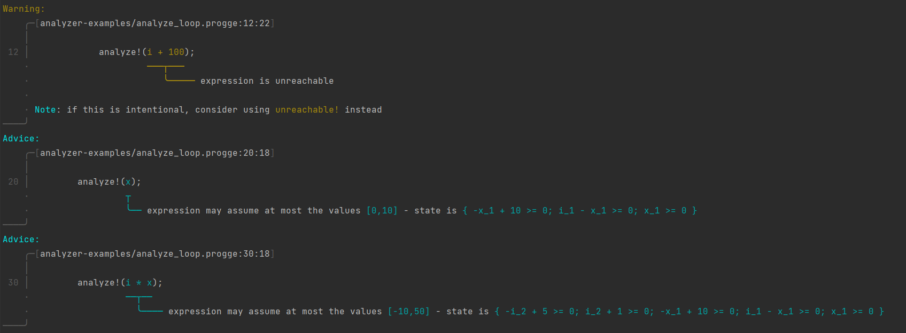
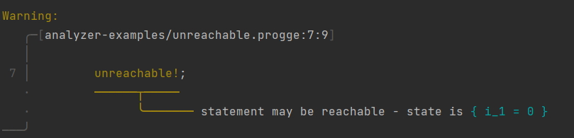

# Proggers

Proggers is a program analysis playground for a simple, imperative language. 

## Features

- Numerical analysis using abstract interpretation
- Type-checking
- Compilation to native code
- Data-flow analyses (planned)
- Symbolic execution (planned)

### Installation

This program needs ELINA to work. See [elina-rs](https://github.com/skius/elina-rs) for more information and installation instructions.
Also, LLVM version 13 is required. [Their website](https://apt.llvm.org/) may be of interest. 

*Neither ELINA nor LLVM are required for type-checking and CFG visualization, hence they could be turned
into a crate feature. Please, feel free to contribute!*

Once the prerequisites are installed, you can install Proggers with: `cargo install --git https://github.com/skius/progge.rs`

### Usage
```
proggers
  <sourcefile>        # the sourcefile to analyze
  --cfg               # visualize the control flow graph
  --typecheck         # type-check the source
  --analyze           # run the abstract interpreter over the source
  --ast               # print the abstract syntax tree
  -o <outputfile>     # compile source into the executable <outputfile>
  --verbose           # print LLVM IR when compiling
```

## Progge

Proggers can analyze programs written in the Progge language.

### Syntax

```
program:    funcdef*
funcdef:    fn var((var: type,)*) -> type { block }
block:      stmt;*
stmt:       let var = expr
            | var = expr
            | expr[expr] = expr
            | if expr { block } [ else { block } ]
            | while expr { block }
            | return [expr]
expr:       var
            | int
            | bool
            | expr binop expr
            | unop expr
            | var(expr,*)
            | [expr,*]
            | [expr; expr]
binop:      + | - | * | / | % | < | <= | > | >= | == | !=
unop:       - | !
var:        [A-Za-z_][A-Za-z0-9_]*
type:       int | bool | [type]

```

### Semantics
Nothing special. The let-bindings are allowed to shadow previous bindings.

## Examples

[**Numerical Analysis**](analyzer-examples/numerical.progge):
Proggers is able to analyze below program and find possible return values, as one can see from the bottom right "`z: [-1,0]`" indicating `z` may be `-1` or `0`.

```rust
fn analyze(x: int, y: int) -> int {
    if x < y {
        while x < y {
            x = x + 1;
            y = y - 1;
        }
        let z = y - x;
        return z;
    }
    return -2;
}
```


Proggers also supports a few directives that make use of the abstract interpretation results.

[**analyze!**](analyzer-examples/analyze_loop.progge): Explicitly prints possible values for a given expression.
For example, running `proggers --typecheck --analyze analyzer-examples/analyze_loop.progge` 
gives the following feedback (image does not show the full output):

*Note that the returned possible values for an expression are an **over-approximation**.*



[**unreachable!**](analyzer-examples/unreachable.progge): Asserts that a statement is unreachable.
For example, running `proggers --typecheck --analyze analyzer-examples/unreachable.progge`
gives the following feedback:

*Note that again, unreachability analysis using abstract interpretation computes an **over-approximation** - that is
it may give false positives (warn about reachable `unreachable!` statements that are in truth unreachable), but may never give false negatives
(if there are no warnings about a `unreachable!`, then it is guaranteed that the statement is unreachable). 
Once symbolic execution is implemented, that can be used to make guaranteed statements about reachability, i.e. under-approximate.*



[**Type-checking**](analyzer-examples/scopes.progge): Proggers notices that there are five distinct variables called `x`, as one can see in the cleaned-up AST that Proggers returns:
```rust 
// Original source code
fn analyze(x: int) -> int {
    let x_2 = 10;
    let x = x;
    let x = x + 1;
    x_2 = 5;
    if true {
        let x = 2;
        x = 3;
    } else {
        let x = 4;
    }

    // returns 1
    return x;
}


// Type-checked AST
fn analyze(x_1: int) {
    let x_2_1 = 10;
    let x_2 = x_1;
    let x_3 = (x_2 + 1);
    x_2_1 = 5;
    if true {
        let x_4 = 2;
        x_4 = 3;
    } else {
        let x_5 = 4;
    }
    return x_3;
}

```

Furthermore, Proggers is able to give nice error messages (thanks to [Ariadne](https://github.com/zesterer/ariadne)):
```rust
// Source
fn foo() -> int {
    return true;
}
```


See [`analyzer-examples/tc_bad`](analyzer-examples/tc_bad) for more examples.


[**Compilation**](codegen-examples/factorial.progge): Proggers can compile programs to native code.
```shell
$ proggers codegen-examples/factorial.progge -t -o factorial
$ ./factorial 4
24
0
1
2
3
4
5
6
7
8
9
10
11
12
13
14
15
16
17
18
19
20
21
22
23
24
```

## License

Licensed under either of

* Apache License, Version 2.0
  ([LICENSE-APACHE](LICENSE-APACHE) or http://www.apache.org/licenses/LICENSE-2.0)
* MIT license
  ([LICENSE-MIT](LICENSE-MIT) or http://opensource.org/licenses/MIT)

at your option.

## Contribution

Unless you explicitly state otherwise, any contribution intentionally submitted
for inclusion in the work by you, as defined in the Apache-2.0 license, shall be
dual licensed as above, without any additional terms or conditions.