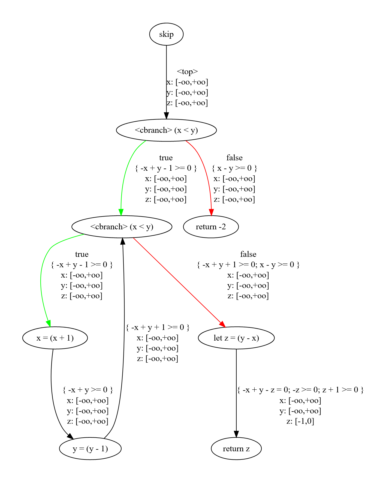
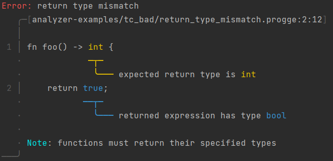

# Proggers

Proggers is a program analysis playground for a simple, imperative language. 

## Features

- Numerical analysis using abstract interpretation
- Type-checking
- Data-flow analyses (planned)
- Symbolic execution (planned)
- Code generation (planned)

### Installation

This program needs ELINA to work. See [elina-rs](https://github.com/skius/elina-rs) for more information and installation instructions.

Once you have ELINA installed, you can install Proggers with: `cargo install --git https://github.com/skius/progge.rs`

### Usage
Run `proggers` to print the usage information.

## Progge

Proggers can analyze programs written in the Progge language.

### Syntax

```
program:    funcdef*
funcdef:    fn var((var: type,)*) -> type { block }
block:      stmt;*
stmt:       let var = expr
            | var = expr
            | if expr { block } [ else { block } ]
            | while expr { block }
            | return [expr]
expr:       var
            | int
            | bool
            | expr binop expr
            | unop expr
            | var(expr,*)
binop:      + | - | * | / | % | < | <= | > | >= | == | !=
unop:       - | !
var:        [A-Za-z_][A-Za-z0-9_]*
type:       int | bool

```

### Semantics
Nothing special. The let-bindings are allowed to shadow previous bindings.

## Examples

[**Numerical Analysis**](analyzer-examples/numerical.progge):
Proggers is able to analyze below program and find possible return values, as one can see from the bottom right "`z: [-1,0]`" indicating `z` may be `-1` or `0`.

```rust
fn analyze(x: int, y: int) -> int {
    if x < y {
        while x < y {
            x = x + 1;
            y = y - 1;
        }
        let z = y - x;
        return z;
    }
    return -2;
}
```


[**Type-checking**](analyzer-examples/scopes.progge): Proggers notices that there are five distinct variables called `x`, as one can see in the cleaned-up AST that Proggers returns:
```rust 
// Original source code
fn analyze(x: int) -> int {
    let x_2 = 10;
    let x = x;
    let x = x + 1;
    x_2 = 5;
    if true {
        let x = 2;
        x = 3;
    } else {
        let x = 4;
    }

    // returns 1
    return x;
}


// Type-checked AST
fn analyze(x_1: int) {
    let x_2_1 = 10;
    let x_2 = x_1;
    let x_3 = (x_2 + 1);
    x_2_1 = 5;
    if true {
        let x_4 = 2;
        x_4 = 3;
    } else {
        let x_5 = 4;
    }
    return x_3;
}

```

Furthermore, Progge is able to give nice error messages (thanks to [ariadne](https://github.com/zesterer/ariadne)):
```rust
// Source
fn foo() -> int {
    return true;
}
```


See [`analyzer-examples/tc_bad`](analyzer-examples/tc_bad) for more examples.
