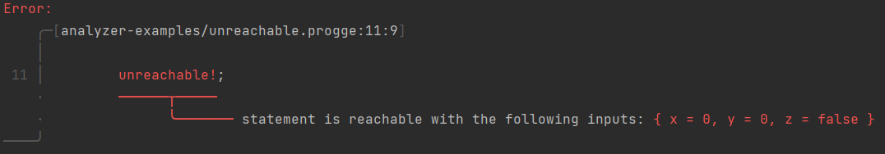

# Proggers

Proggers is a program analysis playground for a simple, imperative language. 

## Features

- [Numerical analysis using abstract interpretation](#Numerical-Analysis-using-Abstract-Interpretation)
- [Symbolic execution](#Symbolic-Execution)
- [Type-checking](#Type-Checking)
- [Compilation to native code](#Compilation)
- Data-flow analyses (planned)

### Installation

Dependencies:
- ELINA - See [skius/elina-rs](https://github.com/skius/elina-rs) for more information and installation instructions.
- LLVM version 13 - [Their website](https://apt.llvm.org/) may be of interest.
- Z3 - See [Z3Prover/z3](https://github.com/Z3Prover/z3) and [prove-rs/z3.rs](https://github.com/prove-rs/z3.rs).

*Neither ELINA nor LLVM nor Z3 are required for type-checking and CFG visualization, hence they could be turned
into a crate feature. Please, feel free to contribute!*

Once the prerequisites are installed, you can install Proggers with: `cargo install --git https://github.com/skius/progge.rs`

### Usage
```
proggers
  <sourcefile>        # the sourcefile to analyze
  --cfg               # visualize the control flow graph
  --typecheck         # type-check the source
  --analyze           # shorthand for --symex --ai
  --symex             # run symbolic execution
  --ai                # run abstract interpretation
  --ast               # print the abstract syntax tree
  -o <outputfile>     # compile source into the executable <outputfile>
  --verbose           # print LLVM IR when compiling
```

## Progge

Proggers can analyze programs written in the Progge language.

### Syntax

```
program:    funcdef*
funcdef:    fn var((var: type,)*) -> type { block }
block:      stmt;*
stmt:       let var = expr
            | var = expr
            | expr[expr] = expr
            | var(expr,*)
            | testcase!
            | unreachable!
            | if expr { block } [ else { block } ]
            | while expr { block }
            | return [expr]
expr:       var
            | int
            | bool
            | expr binop expr
            | unop expr
            | var(expr,*)
            | [expr,*]
            | [expr; expr]
binop:      + | - | * | / | % | < | <= | > | >= | == | !=
unop:       - | !
var:        [A-Za-z_][A-Za-z0-9_]*
type:       int | bool | [type]
```

### Semantics
Nothing special. The let-bindings are allowed to shadow previous bindings.

Progge's special built-ins and which part of Proggers makes use of them:

| Built-In       | Description | AI | SE | TC | C |
|----------------|-------------|----|----|----|---|
| `unreachable!` | Asserts that the control-flow may never reach this statement       |  [x]  |  [x]  |    |   |
| `testcase!`    | Instructs generation of testcases which reach this statement        |  [x]  | [x]   |    |   |
| `assume!(expr)` | Assumes the given bool expression as true           |  [x]  | [x]   |    |   |
| `analyze!(expr)`| Instructs numerical analysis to print an over-approximation of the int expression | [x]   |    |    |   |
| `int_arg(expr)`| Returns the expr-th command line argument converted to an int |    | [x]   |    | [x]  |
| `print_int(expr)`| Prints the given int to stdout |    |    |    | [x]  |

***Legend**: TC: Type-checking, SE: Symbolic Execution, AI: Abstract Interpertation, C: Compilation*
## Features

### Numerical Analysis using Abstract Interpretation

Proggers is able to analyze [below program](analyzer-examples/numerical.progge) and find possible return values, as one can see from the bottom right "`z: [-1,0]`" indicating `z` may be `-1` or `0`.

```rust
fn analyze(x: int, y: int) -> int {
    if x < y {
        while x < y {
            x = x + 1;
            y = y - 1;
        }
        let z = y - x;
        return z;
    }
    return -2;
}
```


Proggers also supports a few directives that make use of the abstract interpretation results.

[**analyze!**](analyzer-examples/analyze_loop.progge): Explicitly prints possible values for a given expression.
For example, running `proggers --typecheck --analyze analyzer-examples/analyze_loop.progge` 
gives the following feedback (image does not show the full output):

*Note that the returned possible values for an expression are an **over-approximation**.*


[**unreachable!**](analyzer-examples/unreachable.progge): Asserts that a statement is unreachable.
For example, running `proggers --typecheck --analyze analyzer-examples/unreachable.progge`
gives the following feedback:

*Note that again, unreachability analysis using abstract interpretation computes an **over-approximation** - that is
it may give false positives (warn about reachable `unreachable!` statements that are in truth unreachable), but may never give false negatives
(if there are no warnings about a `unreachable!`, then it is guaranteed that the statement is unreachable). 
See [Symbolic Execution](#symbolic-execution) for guaranteed statements about reachability.*


#### Guarantees
Abstract interpretation ([Wikipedia](https://en.wikipedia.org/wiki/Abstract_interpretation)) computes an over-approximation,
which means that all possible program behaviors (maybe more, but not less) are captured by it, i.e. the implication
is "If the real program exhibits a behavior, then that behavior is contained in the abstract interpretation's over-approximation".

In short, abstract interpretation can prove absence of unwanted program behaviors, which might be e.g. index-out-of-bounds
exceptions(TODO), execution of `unreachable!` statements, or function calls whose arguments do not satisfy the function's preconditions.


### Symbolic Execution

[**testcase!**](analyzer-examples/symex_arr_hard.progge): Generates testcases (i.e. argument values for the function)
that reach the statement. For example, running `proggers --typecheck --symex analyzer-examples/symex_arr_hard.progge` gives:

*Note: Testcase generation also works for calls to `int_arg` - see [`symex_blackbox.progge`](analyzer-examples/symex_blackbox.progge)*

```
analyzer-examples/symex_arr_hard.progge:7:13: sample inputs reaching this statement:
{ x = 1, y = 0 }
{ x = 0, y = 1 }
{ x = 0, y = 2 }
{ x = 2, y = 1 }
{ x = 1, y = 2 }
```

[**unreachable!**](analyzer-examples/unreachable.progge): Furthermore, if a given `unreachable!` is not actually unreachable, symbolic execution
will throw an error and give a sample input that reaches the statement.
For example, running `proggers --typecheck --symex analyzer-examples/unreachable.progge` gives:


#### Guarantees

Symbolic execution ([Wikipedia](https://en.wikipedia.org/wiki/Symbolic_execution)) computes an under-approximation, which means
the implication is "If symbolic execution reports a path (set of input values), then the real program must also
follow that path". 

In short, symbolic execution can prove reachability of statements by giving concrete example inputs, or, in other words,
it can prove presence of certain program behaviors.

### Type-Checking

[`let` shadowing/lexical scopes](analyzer-examples/scopes.progge): Proggers notices that there are five distinct variables called `x`, as one can see in the cleaned-up AST that Proggers returns:
```rust 
// Original source code
fn analyze(x: int) -> int {
    x = 0;
    let x_2 = 10;
    let x = x;
    let x = x + 1;
    x_2 = 5;
    if true {
        let x = 2;
        x = 3;
    } else {
        let x = 4;
    }

    // returns 1
    return x;
}


// Type-checked AST
fn analyze(x_1: int) {
    x_1 = 0;
    let x_2_1 = 10;
    let x_2 = x_1;
    let x_3 = (x_2 + 1);
    x_2_1 = 5;
    if true {
        let x_4 = 2;
        x_4 = 3;
    } else {
        let x_5 = 4;
    }
    return x_3;
}

```

Furthermore, Proggers is able to give nice error messages (thanks to [Ariadne](https://github.com/zesterer/ariadne)):
```rust
// Source
fn foo() -> int {
    return true;
}
```


See [`analyzer-examples/tc_bad`](analyzer-examples/tc_bad) for more examples.


### Compilation

Proggers can compile [programs](codegen-examples) to native code.
```shell
$ proggers codegen-examples/factorial.progge -t -o factorial
$ ./factorial 4
24
0
1
2
3
4
5
6
7
8
9
10
11
12
13
14
15
16
17
18
19
20
21
22
23
24
```

## License

Licensed under either of

* Apache License, Version 2.0
  ([LICENSE-APACHE](LICENSE-APACHE) or http://www.apache.org/licenses/LICENSE-2.0)
* MIT license
  ([LICENSE-MIT](LICENSE-MIT) or http://opensource.org/licenses/MIT)

at your option.

## Contribution

Unless you explicitly state otherwise, any contribution intentionally submitted
for inclusion in the work by you, as defined in the Apache-2.0 license, shall be
dual licensed as above, without any additional terms or conditions.